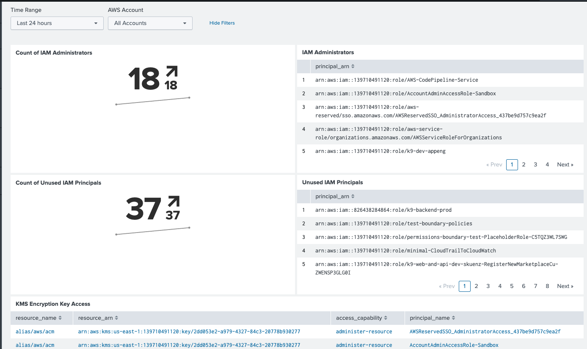
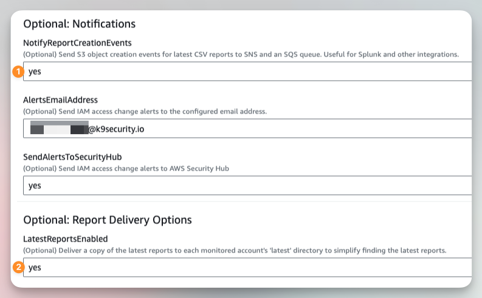

# k9 Security Splunk Integration
This repo contains the k9 Security Splunk integration tools.

These tools help you load the k9 Security csv files into Splunk for viewing in the k9 Security dashboard:


The tools include:

* k9security.bash - shell convenience functions (customer changes required) 
* stage-k9security-data-for-ingest.sh - a script to stage recent files (7d) for import  

These tools currently populate a local Splunk installation running in Docker.  You can load
into a production Docker installation by replacing the `docker cp` to the Splunk spool directory
with `cp` to your own spool directory.

## Dependencies

* bash shell
* aws cli
* credentials providing access to your k9 Security reports bucket

Then you will need to configure several entities in Splunk:

## Set-up Splunk
Set-up Splunk with a source type, index, data input(s), and dashboard. 

### `k9_security_analysis_v1:csv` Source Type

Define the `k9_security_analysis_v1:csv` Source Type:

```ini
[k9_security_analysis_v1:csv]
BREAK_ONLY_BEFORE_DATE =
DATETIME_CONFIG =
INDEXED_EXTRACTIONS = csv
KV_MODE = none
LINE_BREAKER = ([\r\n]+)
NO_BINARY_CHECK = true
SHOULD_LINEMERGE = false
TIMESTAMP_FIELDS = analysis_time
TIME_FORMAT = %Y-%m-%dT%H:%M:%S.%6N%:z
TZ = GMT
category = Structured
description = k9 Security principals data in v1 csv format.
disabled = false
pulldown_type = 1
```

### `k9_security` Index

Define the `k9_security` index, e.g. in `/opt/splunk/etc/apps/search/local/indexes.conf`:

```ini
[k9_security]
coldPath = $SPLUNK_DB/k9_security/colddb
enableDataIntegrityControl = 0
enableTsidxReduction = 0
```

### Splunk for AWS Input for monitoring Secure Inbox S3 bucket (preferred)
If you are using Splunk Cloud, then you will need to configure a data input for in the Splunk for AWS add-on.
k9 Security recommends and supports the [Splunk SQS-based S3 input](https://docs.splunk.com/Documentation/AddOns/released/AWS/SQS-basedS3) approach.
At the time of writing, the Splunk Data Manager does support custom S3 input sources.

First, enable delivery and notification of the 'latest' reports by setting the `LatestReportsEnabled` and 
`NotifyReportCreationEvents` parameters to `yes` in your `k9-report-delivery` stack.  If you are missing either of these
parameters, please update to the latest report-delivery CloudFormation template, which is always available at:

  [https://k9-customer-tools.s3.amazonaws.com/configure-k9-resources-for-report-delivery.template](https://k9-customer-tools.s3.amazonaws.com/configure-k9-resources-for-report-delivery.template)

Your parameters should look like:


Second, deploy the stack.  The stack will create an SNS topic and SQS queue, both named `notify-k9-reports-s3-events`, per Splunk's architecture.

Third, ensure the IAM user or role used by Splunk Cloud for this Input has the permissions described in the Splunk [configure AWS permissions for SQS access](https://docs.splunk.com/Documentation/AddOns/released/AWS/SQS-basedS3#Configure_AWS_permissions_for_SQS_access) section of the SQS integration documentation.

Fourth, configure a data input for the `notify-k9-reports-s3-events` queue.

Fifth, test the integration by downloading one of the latest csv files from your S3 bucket then uploading it back to the same directory.  You should see a message queued in the `notify-k9-reports-s3-events` queue.

Now you can proceed to creating the [k9 Daily Review Dashboard](#k9-daily-review-dashboard).

### Custom Data in S3 Input
If you use Splunk Cloud, then define a 'Custom Data Type' Data Input for S3 with notifications sent via SQS (`Create New Input > Custom Data Type > SQS-based S3`).

Configure the S3 SQS Data Input with:

* AWS user: `<a Splunk user with access to the report delivery account>`
* Region: `us-east-1`
* Queue name: `notify-k9-reports-s3-events`
* Source type: `k9_security_analysis_v1:csv` 
* Advanced settings:
  * CSV: yes (checked) 

You should be able to use default values for other settings. 

### Directory Monitoring Input
If you are hosting Splunk yourself, then define a directory monitoring input using the previously-defined index and sourcetype, e.g.:

```ini 
[monitor:///var/local/splunk-inputs/k9security]
disabled = false
host = k9-security
index = k9_security
sourcetype = k9_security_analysis_v1:csv
```

### k9 Daily Review Dashboard

Create a `k9 Daily Review` dashboard ([source](k9_daily_review.dashboard.xml)).

Now populate the `k9_security` index with k9 csv report data.

## Populating

1. Update the k9security.bash file with the name of the bucket containing k9 Security reports and your customer id
2. Load `k9security.bash` into your shell with `source k9security.bash`
3. Execute `sync-k9security-inbox` in your shell; this command synchronizes reports in s3 `~/tmp/k9security-inbox/` with `aws sync`
4. Execute `./stage-k9security-data-for-ingest.sh`
